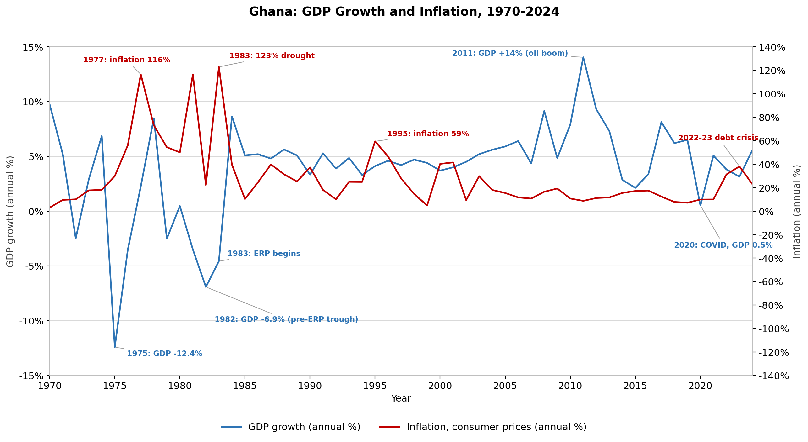

# Ghana: GDP Growth vs. Inflation, 1970–2024

A reproducible analysis of Ghana's annual real GDP growth and consumer-price
inflation over five and a half decades, plotted on a shared timeline and read
against the macroeconomic and policy events that drove the major turning points.



## Data

| Series | Indicator code | Unit | Period |
|---|---|---|---|
| GDP growth (annual) | `NY.GDP.MKTP.KD.ZG` | % | 1970–2024 |
| Inflation, consumer prices (annual) | `FP.CPI.TOTL.ZG` | % | 1970–2024 |

**Source:** World Bank, World Development Indicators (WDI). Real GDP is in
constant 2015 US-dollar prices. The tidy series used by the script lives in
[`data/ghana_gdp_inflation_1970_2024.csv`](data/ghana_gdp_inflation_1970_2024.csv);
the original World Bank export (with metadata) is kept in
`data/source_world_bank_wdi.xlsx`.

## What the data shows

Over the full sample, growth averaged about **3.9%** a year (σ ≈ 4.3) and
inflation averaged about **29%** (σ ≈ 27) — an unusually high and volatile
inflation mean for a half-century, concentrated in the pre-reform decades. The
broad pattern is one of **negative co-movement**: the worst growth collapses
line up with the highest inflation, consistent with supply shocks and
fiscal-monetary instability hitting output and the price level together.

### 1970–1983 — Instability and the inflationary spiral
This is the most turbulent stretch in the series. Growth swung violently and
inflation ratcheted from single digits into triple digits.
- **1975 (growth −12.4%, the all-time trough):** the 1973–74 oil shock, drought,
  and a collapse in cocoa export earnings hit an economy already strained by
  political instability and a string of coups.
- **1977 (inflation ~116%):** chronic fiscal deficits financed by money
  creation — textbook **fiscal dominance** — combined with shortages and a heavily
  overvalued cedi fed a hyper-inflationary environment.
- **1981–1983 (inflation ~117% then ~123%, the inflation peak):** the crisis
  bottomed out. Growth fell to **−6.9% in 1982**, the pre-reform trough. 1983
  brought severe drought, bushfires, and the return of roughly a million
  Ghanaians expelled from Nigeria, all colliding with an exhausted policy
  framework.

### 1983–2000 — Reform, disinflation, but lingering volatility
1983 is the structural break. The **Economic Recovery Programme (ERP)**, backed
by the IMF and World Bank, devalued the cedi, liberalised prices, and reined in
deficit monetisation.
- **1984 (growth rebounds to +8.6%):** rains returned and the reforms restored
  supply, producing a sharp recovery off a very low base.
- Inflation trended down but stayed in double digits and spiked periodically —
  e.g. **1995 (~59%)**, tied to fiscal slippage, cedi depreciation, and the
  introduction (and contested rollout) of VAT. Disinflation under structural
  adjustment was real but incomplete and fragile.

### 2000–2019 — Stabilisation, the oil boom, and inflation targeting
Macro management matured. The Bank of Ghana adopted **inflation targeting** in
2007, anchoring expectations more credibly than at any earlier point.
- **2000 (inflation ~40%):** an election-cycle spending surge plus a terms-of-
  trade shock (falling cocoa/gold prices, rising oil import bills) and a sharp
  cedi slide.
- **2011 (growth +14.0%, the peak):** the first full year of production from the
  offshore **Jubilee oil field** (online late 2010), layered on top of a 2010 GDP
  rebasing that revealed a much larger economy. This is the single most dramatic
  growth observation in the series.
- The 2010s settled into steadier mid-single-digit growth with inflation mostly
  in the 8–17% range — historically low and stable by Ghanaian standards.

### 2020–2024 — Pandemic shock and the debt/currency crisis
- **2020 (growth +0.5%):** COVID-19 — a near-stall rather than a contraction,
  but the weakest year since the early reform period.
- **2022–2023 (inflation re-surges to ~31% then ~38%):** a debt-sustainability
  crisis, steep cedi depreciation, and imported food/fuel pressure (amplified by
  the Russia–Ukraine war) pushed inflation back up sharply, prompting a 2023 IMF
  programme and a domestic debt restructuring. **2024** shows early disinflation
  (~23%) as growth recovers toward +5.6%.

## The monetary-economics takeaway

Ghana's history is a clean illustration of **fiscal dominance**: the episodes of
runaway inflation (1977, 1981, 1983, and the 2022–23 resurgence) coincide with
periods when deficits were monetised or the currency was forced to absorb fiscal
and external imbalances. The post-1983 disinflation and the post-2007
inflation-targeting era show the converse — that credible policy frameworks and
exchange-rate discipline can compress both the *level* and the *volatility* of
inflation, even when the central bank cannot fully insulate the economy from
external shocks. Growth, meanwhile, was historically driven by supply
conditions (rainfall, commodity prices, oil) more than by demand management,
which is why the largest output swings cluster around shocks rather than around
the inflation cycle itself.

## Reproduce it

```bash
pip install -r requirements.txt
python src/analysis.py
```

This reads the CSV and writes the figure to `figures/`.

## Repository structure

```
ghana-gdp-inflation/
├── data/
│   ├── ghana_gdp_inflation_1970_2024.csv   # tidy series (year, gdp_growth, inflation)
│   └── source_world_bank_wdi.xlsx          # original World Bank export + metadata
├── figures/
│   └── ghana_gdp_inflation_1970_2024.png   # generated chart
├── src/
│   └── analysis.py                         # loads data, builds chart
├── requirements.txt
├── LICENSE
└── README.md
```

## License & attribution

Code released under the MIT License (see `LICENSE`). The underlying data are
World Bank World Development Indicators, distributed under
[CC BY-4.0](https://datacatalog.worldbank.org/public-licenses#cc-by).
